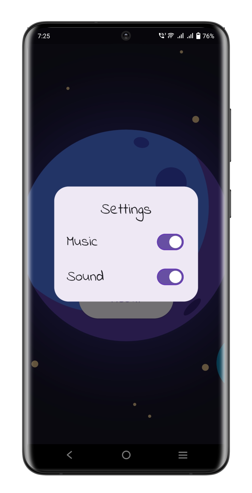

# Tic Tac Toe

A classic game brought to life with a modern twist by using the power of Flutter.

## Key Features
- Sleek Design
- Responsive Gameplay
- Background Music
- Sound Effects
- Win Streak Tracker
- Achievements Bar
- User Preferred Settings

## Screenshots

## Getting Started
1. Clone this repository.
2. Make sure you have Flutter installed on your machine.
3. Navigate to the project directory and run `flutter pub get` to install dependencies.
4. Run the app using `flutter run`.

    ### OR

    To try out the app, you can download and install the APK file from the following link:
    [Download APK](https://drive.google.com/file/d/1F5I415sAdCH15wEOyu8hQ1T3s1i08Kzm/view?usp=sharing)
    
    Make sure to enable installation from unknown sources on your device before installing the APK.
    
    Once the APK is installed, you can open the app and start enjoying.
